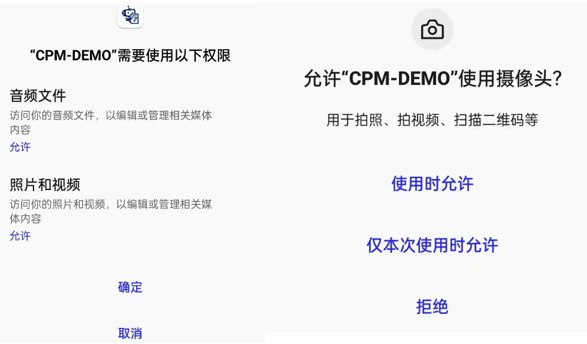
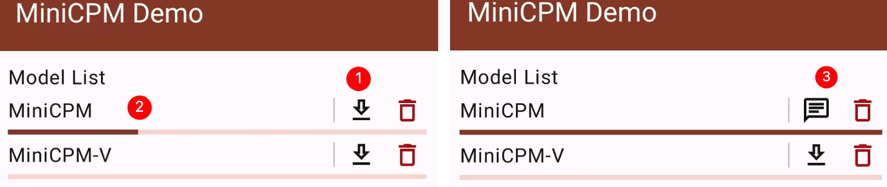
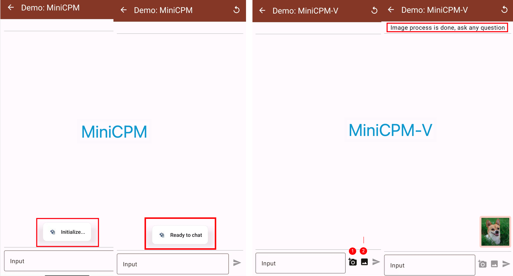

# MLC-MiniCPM

基于 [MLC-LLM](https://github.com/mlc-ai/mlc-llm) 开发，将 MiniCPM 和 MiniCPM-V 在 Android 手机端上运行。

## 安卓安装包

0. 安装 [安卓软件安装包](https://openbmb.oss-cn-hongkong.aliyuncs.com/model_center/mobile/android/MiniCPM.apk)

1. 允许相册、拍照权限：MiniCPM-V 模型处理多模态数据，需要相应权限来获取图片

    

2. 下载模型：（1）点击下载按钮 (2) 等待进度条 (3) 开始对话

    **注意：当前两个模型不能同时下载，会造成闪退（软件上存在一些 bug，待修复）**

    

3. 和 MiniCPM 对话: (1) 等待模型初始化，直到 "Ready to chat" 弹出。 (2) 打字并点击发送交流

4. 和 MiniCPM-V 对话: (1) 等待模型初始化，直到 "Ready to chat" 弹出。 (2) 上传图像 (3) 等待 "process image done" 出现 (4) 打字并点击发送交流

    **注意：图像处理需要花费一些时间。**

    

5. 演示：

    


注意模型在部署到手机时使用了 4-bit 量化，可能会损失一定的性能. 性能请参考 [原版模型](https://github.com/OpenBMB/miniCPM).

## 电脑端编译模型环境准备

参考 https://llm.mlc.ai/docs/deploy/android.html 去安装依赖

其中 **Compile PyTorch Mdoels from HuggingFace** 这一步, 改成使用我们的 github 代码然后执行以下命令，来安装 mlc_chat 用于编译模型：
```
mkdir -p build && cd build
# generate build configuration
python3 ../cmake/gen_cmake_config.py && cd ..
# build `mlc_chat_cli`
cd build && cmake .. && cmake --build . --parallel $(nproc) && cd ..
# install
cd python && pip install -e . && cd ..
```

## 编译模型

从 huggingface 下载模型放至 `dist/models`.

对于 MiniCPM，运行
```
MODEL_NAME=MiniCPM
QUANTIZATION=q4f16_1
MODEL_TYPE=minicpm
mlc_chat convert_weight --model-type ${MODEL_TYPE} ./dist/models/${MODEL_NAME}-hf/ --quantization $QUANTIZATION -o dist/$MODEL_NAME/
mlc_chat gen_config --model-type ${MODEL_TYPE} ./dist/models/${MODEL_NAME}-hf/ --quantization $QUANTIZATION --conv-template LM --sliding-window-size 768 -o dist/${MODEL_NAME}/
mlc_chat compile --model-type ${MODEL_TYPE} dist/${MODEL_NAME}/mlc-chat-config.json --device android -o ./dist/libs/${MODEL_NAME}-android.tar
cd ./android/library
./prepare_libs.sh
cd -
```

对于 MiniCPM-V (视觉版本)，运行
```
MODEL_NAME=MiniCPM-V
QUANTIZATION=q4f16_1
MODEL_TYPE=minicpm_v
mlc_chat convert_weight --model-type ${MODEL_TYPE} ./dist/models/${MODEL_NAME}-hf/ --quantization $QUANTIZATION -o dist/$MODEL_NAME/
mlc_chat gen_config --model-type ${MODEL_TYPE} ./dist/models/${MODEL_NAME}-hf/ --quantization $QUANTIZATION --conv-template LM --sliding-window-size 768 -o dist/${MODEL_NAME}/
mlc_chat compile --model-type ${MODEL_TYPE} dist/${MODEL_NAME}/mlc-chat-config.json --device android -o ./dist/libs/${MODEL_NAME}-android.tar
cd ./android/library
./prepare_libs.sh
cd -
```
其中 `--sliding-window-size` 用于在手机端限制资源使用, 可根据手机具体能力调整.

## Build Android App

进入 `android/` 文件夹，使用 Android Studio 构建 (参考 https://llm.mlc.ai/docs/deploy/android.html)